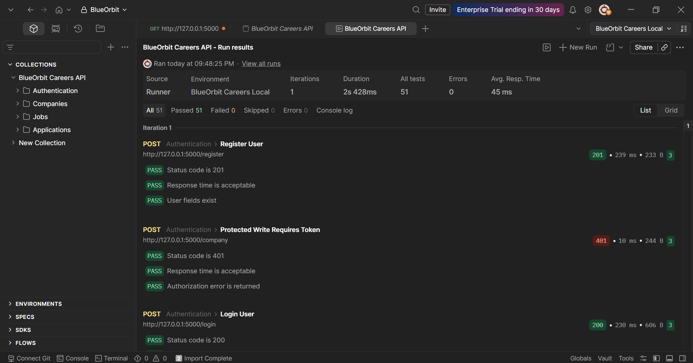
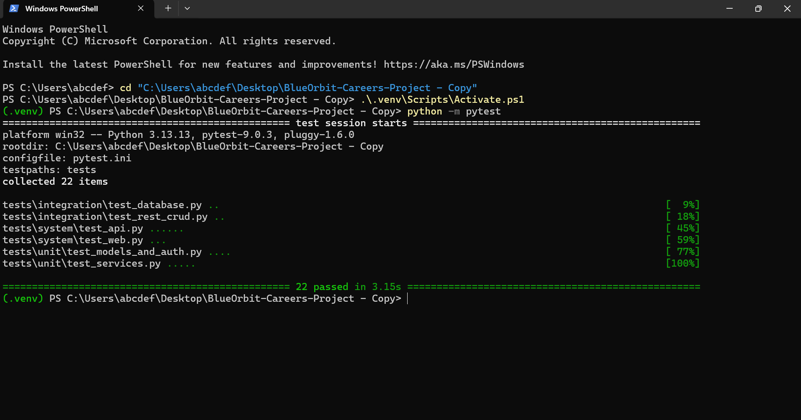

# BlueOrbit Careers

A full-stack career portal with a JWT-protected REST API, layered architecture, and full test coverage.

   

**Live demo:** https://mirzamemovic.pythonanywhere.com

BlueOrbit Careers manages the four core entities of a job marketplace: users, companies, jobs, and applications. It includes a JWT-protected REST API, a server-rendered dashboard, SQLite persistence, automated pytest coverage, and a Postman collection for external API testing.

The codebase is structured in layers:

```text
routes -> services -> repositories -> models
```

## Screenshots

Postman collection runner results:



Pytest results:



## Technology Stack

- Python 3.13
- Flask
- Flask-RESTful
- Flask-JWT-Extended
- Flask-SQLAlchemy
- SQLite
- Pytest
- Postman

## Architecture

The application follows a layered architecture with clear separation of concerns:

```text
routes (api.py)          -> HTTP handling, request validation, response formatting
services (services.py)   -> business logic and orchestration
repositories.py          -> data access and query encapsulation
models.py                -> SQLAlchemy ORM definitions and schema constraints
```

This separation keeps business logic easier to test. Services can be tested without running the full web app, while repository and API tests verify how the layers work together.

## Design Decisions

**Flask-RESTful over plain Flask routes.** Resource-based classes keep endpoint behavior organized by HTTP method.

**JWT over session authentication.** The API is designed for external clients such as Postman. JWT makes protected API requests stateless and easy to test.

**SQLite for development.** SQLite keeps the project simple to run locally while still using SQLAlchemy models and relationships.

**Multiple testing levels.** Unit tests cover isolated logic, integration tests verify database and API interaction, system tests exercise end-to-end application behavior, and Postman validates the API from an external client.

## Installation

Create and activate a virtual environment.

Windows PowerShell:

```powershell
python -m venv .venv
.\.venv\Scripts\Activate.ps1
```

Mac / Linux:

```bash
python3 -m venv .venv
source .venv/bin/activate
```

Install dependencies:

```bash
pip install -r requirements.txt
```

## Database

The application uses SQLite. Tables are created automatically on startup with `db.create_all()`.

By default, the local database is created at:

```text
instance/blueorbit.sqlite3
```

The registered users can be viewed in the `users` table. Passwords are stored as hashes, not plain text.

No manual migration command is required for a clean run.

## Run

```bash
python app.py
```

Open:

```text
http://127.0.0.1:5000
```

Health check:

```text
GET /health
```

## Authentication

Register a new account:

```text
POST /register
```

Log in and receive a JWT:

```text
POST /login
```

The Flask backend creates the token in `career_portal/api.py` with `create_access_token()`. The login response returns an `access_token`.

Protected `POST`, `PUT`, and `DELETE` requests send the token using:

```text
Authorization: Bearer <access_token>
```

GET endpoints are public.

## REST API

Users:

- `POST /register`
- `POST /login`

Companies:

- `GET /companies`
- `GET /company/<id>`
- `POST /company`
- `PUT /company/<id>`
- `DELETE /company/<id>`

Jobs:

- `GET /jobs`
- `GET /job/<id>`
- `POST /job`
- `PUT /job/<id>`
- `DELETE /job/<id>`

Applications:

- `GET /applications`
- `GET /application/<id>`
- `POST /application`
- `PUT /application/<id>`
- `DELETE /application/<id>`

Legacy dashboard routes under `/api/opportunities` remain available for backwards compatibility. Mutating requests there also require JWT.

## Testing

The project includes 22 automated pytest tests across unit, integration, and system layers, plus a Postman collection that exercises the full API contract.

Run all tests:

```bash
python -m pytest
```

Run a specific layer:

```bash
python -m pytest tests/unit
python -m pytest tests/integration
python -m pytest tests/system
```

The test app uses an isolated SQLite database in `tests_runtime/`, so tests do not touch the development database.

## Postman Collection

Two files are included for API contract testing:

- `BlueOrbit_Careers.postman_collection.json`
- `BlueOrbit_Careers.postman_environment.json`

Import both into Postman, select the `BlueOrbit Careers Local` environment, and run the collection in order.

The collection:

- registers a user
- logs in and automatically stores the JWT with `pm.environment.set("jwt_token", ...)`
- performs CRUD on companies, jobs, and applications
- verifies the `location` field added to the Job model
- confirms detail endpoints return single resources correctly
- confirms protected write requests fail with `401 Unauthorized` when no JWT is provided
- checks status codes, response time, and JSON field presence

The `401 Unauthorized` Postman test is expected behavior. It proves that protected endpoints reject requests without a valid JWT.

## Model Extension

`JobModel` was extended with a required `location` field, applied consistently across:

- SQLAlchemy model definition
- SQLite schema reference
- API validation
- JSON serializers
- request payloads
- unit tests
- integration tests
- system tests
- Postman collection tests

## API Behavior

- Database tables are created automatically when `create_app()` runs.
- `POST`, `PUT`, and `DELETE` REST operations require JWT authentication.
- Validation errors return `400 Bad Request`.
- Missing records return `404 Not Found`.
- Missing or invalid tokens return `401 Unauthorized`.

## Background

Built originally as part of the Software Testing course at Public International Business College Mitrovica, then extended independently with JWT authentication, a Postman test suite, and a refactor to a layered architecture.
